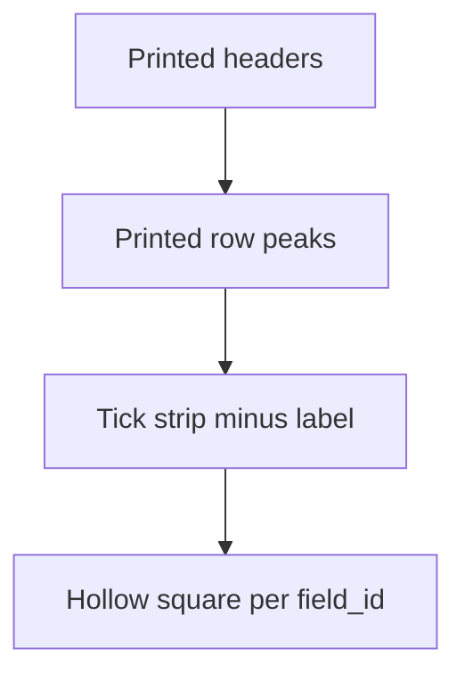
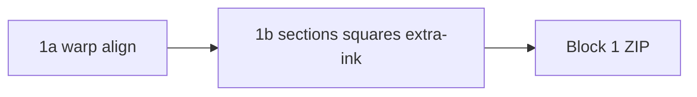

# Block 1 — version history and architecture

**Current generation: B1.9** (ECC + decoupled page gate). Public API has always been `normalize_document()`; callers never pick 1a/1b/1c.

Live code: `src/med_doc/normalization/` on branch `block1`. Contract notes: [`docs/engineering-brief.md`](../engineering-brief.md).

Print templates (not “Block 1 versions”): digital **v0** `templates/lab_request_canonical.json` (2048×1720, 124 checkboxes) vs clinic **v1** `templates/lab_request_v1_canonical.json` (2048×1754, 138 checkboxes).

---

## B1.1 — Warp + overlay snap (2026-08-14)

**Git:** `cd50e08` on `main` / early `block1`. Colab package `block1/`.

**Intent:** Photo → canonical canvas → one crop per template field.

**Architecture**

- Document quad, `four_point_transform`, orientation.
- Overlay bboxes from JSON; hollow-ring snap in columns.
- Fine-align kept only when checkbox-grid score improves.
- Default overlay was later corrected to **v0**; clinic sheets need **v1**.

**Data then:** Digital blank crops were hollow squares (grid ~0.78). Photographed clinic print drifted on v0 (extra Molecular / Pap / tubes).

---

## B1.2 — v0/v1 pick + letterbox (2026-08-14)

**Facts:** `decision-v0-default-v1-clinic`, `decision-letterbox-fullpage`, `decision-photo-v1-snap-matching`.

**Architecture change:** `_pick_revision` / later `pick_revision` scores v0 vs v1 snap; full-page scans **letterbox by height** (no anisotropic stretch). Clinic photos use v1 1-to-1 checkbox snap in columns.

---

## B1.3 — Gated section-bar snap (2026-08-20)

**Fact:** `block1-section-bar-gated-snap`. Report: `block1/section_snap_benchmark.md`.

**Architecture:** After ring snap, try per-column printed header bars → Y affine. **Keep only if** `_checkbox_grid_score` beats rings by ≥ 0.02.

**Data then**

| Setup | Hollow / grid |
|---|---|
| Synthetic rendered + photographed v0 | **95.2%** (unchanged by the gate) |
| Clinic 5-sheet mean | 54.3% → **55.2%** |

Test-name / letter-initial matching was prototyped and **not** shipped.

---

## B1.4 — Territories, header lock, tick windows (2026-08-20)

**Facts:** `template-section-territories`, `block1-header-to-next-section-snap`, superseded `block1-tick-window-gated-crops`.

**Architecture**

- Mains = black header through next bar; subs = bold subheads + JSON groups.
- `snap_sections`: lock mains to headers, rows to printed-peak order (not overlay field Y).
- Tick box = leftover from column wall to boxed test-name text.
- `apply_tick_windows`: ~16–24 px hollow square inside the red tick strip; if sheet-wide grid drops >0.02 vs `snap_overlay`, fall back to snap bboxes.
- Synthetic hollow **≥ 95%**.

---

## B1.5 — 1a / 1b split (2026-08-28)

**Facts:** `block1-1a-1b-split`, `block1-no-mark-classification`. Session `2026-08-28-144429`.

**Architecture**

| Stage | Module | Does |
|---|---|---|
| 1a | `block1a.py` | Revision pick, warp, page `fine_align`, `col_shifts` |
| 1b | `block1b.py` | `snap_overlay` → bake col shifts → `snap_sections` → per-section **dy** (peaks vs **row tops**) → tick squares (prefer **ink-in-ring**) → extra-ink `crops/sections/{id}.png` |

Square placement may fall back to dy-shifted snap if tick-window grid is >0.02 worse; **extra-ink always keeps section lock**. Block 1 does **not** classify marks (`mark_classification: deferred_to_block3`).

**Data then:** Pytest `tests/test_normalization.py` 25 passed, synthetic hollow ≥ 95%.

---

## B1.6 — 1c crop gate (2026-08-31)

**Fact:** `block1-1c-crop-validate`. Code: `block1c.py`, wired in `pipeline.py`.

**Architecture** (does not classify ticks)

1. If the crop is already a printed square (empty hollow or ink-in-ring) and not a text line → `crop_ok`.
2. Else one widened hollow / ink-ring rematch: reject neighbour-steal and dark section headers.
3. Empty fields rematch onto **hollow** rings only (do not steal a neighbour’s ink).
4. Else keep the 1b bbox and set `crop_needs_hitl`.
5. Large overlay-sized cells skip 1c unless they look like a label.

ZIP checkbox metadata: `crop_ok`, `crop_needs_hitl`, `crop_validate_status` (`ok` / `retry` / `hitl` / `skip`). Block 3 ORs `crop_needs_hitl` into `needs_hitl`.

### Current data (B1.6 + Block 3 B3.5, Paddle off, 2026-08-31)

Synthetic v0 blank `data/samples/synthetic/lab_request_v0_blank.png`, 10 gold ticks drawn on template squares, optional `photograph()` tilt. **No clinic PHI.** Full JSON: [data/synthetic-10tick-scorecard.json](./data/synthetic-10tick-scorecard.json).

| Sheet | 1c summary | Block 3 TP / FN / FP |
|---|---|---|
| Blank digital | retry 111, skip 13, hitl 0 | 0 / — / **0** |
| 10 ticks digital | ok 10, retry 105, skip 9 | **10 / 0 / 0** |
| Blank photo | retry 113, skip 11 | 0 / — / **3** |
| 10 ticks photo | ok 9, retry 105, skip 10 | **4 / 6 / 5** |

Pre-1c / pre-geometry Block 3 on the same 10 digital ticks was **0 / 10 / 0**.

Committed inputs (no PHI):

- `data/samples/synthetic/lab_request_v0_blank.png`
- `templates/lab_request_canonical.json` (v0)
- `templates/lab_request_v1_canonical.json` (v1)

---

## B1.7 — piecewise 1a + adaptive 1c (2026-09-12) — **current**

**Intent:** Flash/shadow photos break a single global paper percentile and 1c rematch-by-distance.

**Architecture**

1. **1a** `fine_align`: local paper / flatten for column peaks; RANSAC partial-affine + 4×3 residual flow when it improves grid score (`normalization/register.py`, `illumination.py`). `column_y_shifts` must beat dy=0 by a margin and **must not use the search bound** (±24 px is one label row — that put order-7 chemistry/immunology on the wrong row).
2. **1c** `has_hollow_ring` / search: tile Otsu / `paper_map` instead of `percentile(gray, 90)` on the whole canvas.
3. **1c rematch:** rank candidates by RANSAC-fitted neighbour prior (template→observed from already-OK boxes), mixed with distance to the 1b center. If the 1b window is a **label strip**, snap to the **same-row box on the left** (order-8 empty order: crops sat on printed names). Search always includes ink-in-ring so a ticked box is not skipped because the 1b crop was blank paper.

Does not classify ticks. Photo-realistic distortions (perspective, shadow, blur, JPEG) live in `med_doc.eval.photoreal` and `tests/test_photoreal_marks.py` so registration and mark classification can be scored separately. N=10 gold ticks remains too small for photo accuracy claims.

**Clinic follow-on (2026-09-13), same B1.7 generation:** bound Y-shift ignore (`80233a4`, order-7 ALP-only → order-8 empty) then left rematch + ink-in-ring (`786156f`, order-9 **2 TP / 8 FP / 5 FN**, precision **0.20**, recall **~0.29**). Full chain + Colab: [`clinic-eval-chain.md`](./clinic-eval-chain.md).

---

## B1.8 — handwriting 1c + page alignment gate (2026-09-15)

**Intent:** Phase 1 of the clinic dump post-mortem. 1c only gated checkboxes; tubes sat on NT-proBNP / Lipoprotein (a); pages at alignment 0.36 still said `success`; `skip` was `ok=True`; rematch wrote boxes into the shared template.

**Architecture**

1. **v1 overlay:** tube / office / clinical_info bboxes moved to the footer (and below the header bar). Tubes no longer overlap cardiovascular labels.
2. **1b** `snap_handwriting_fields`: footer/header landmark dy applied to write-ins; handwriting crops come from the section-shifted template, not the pre-section overlay.
3. **1c** validates handwriting: tubes = short underline/blank, not body text; text boxes = bounded blank, not a header bar. Fail → `crop_needs_hitl`.
4. **Page gate:** `alignment_confidence < 0.6` → `needs_review`, status `page_align`, no rematch, batch `status` is not `success`.
5. **Skip:** large unverified checkbox cells rematch or HITL — never `ok=True` without a hollow ring.
6. **Rematch** is per-document (`bbox_overrides` in extra); it does **not** persist into the template.
7. **Template pick** scores (v0 vs v1, checkbox counts) are logged; a batch that resolves identical-looking sheets to different `template_id`s is flagged.

---

## B1.9 — ECC + decoupled page gate (2026-09-16) — **current**

**Intent:** Clinic photos sit at alignment 0.36–0.54. The page gate must not erase per-field 1c/3 scores; registration has to actually move.

**Architecture**

- `fine_align` runs Euclidean **ECC** against `render_blank_form` (edge maps), then piecewise RANSAC residual. Keep a warp if grid score is not worse.
- 1c **column neighbour fill**: RANSAC on confirmed boxes in a column, then recrop unresolved fields at the predicted center.
- Document `needs_review` when alignment &lt; 0.6 or template pick relative margin &lt; 10%. Crops are still validated individually.
- Block 5 `registration_failure_suspected` also fires when implausible tube counts were rejected, not only when every tube crop is empty.

---

## What later Block 1 versions must not do

- Tick classification (Block 3).
- Unbounded 1c rematch loops.
- Committing clinic PNGs.
