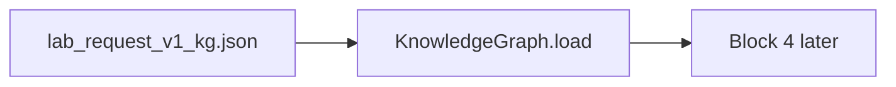

# Block 2 — current status (frozen KG)

Block 2 is **not** versioned in the same train as 1a/1b/1c. Live JSON: `kg/lab_request_v1_kg.json`. Fact: `block2-clinical-kg`. Git: `137e323` on `origin/block2`; present in `src/med_doc/kg/` on branch `block1`.

## Architecture (current)

Deterministic catalogue: 138+ tests/profiles, tube rules, alias/acronym resolution, fuzzy match for write-ins, `validate_request()`, `assume()` **for Block 4**.

Block 3 **imports** this JSON. It does not run per-sheet Block 2 ZIP fusion (`block3-ingests-block1-zip-kg-import`).

Standalone Colab: `block2/`. API: `KnowledgeGraph.load()`, `expand_profile`, `calculate_expected_tubes`, `validate_request`.
