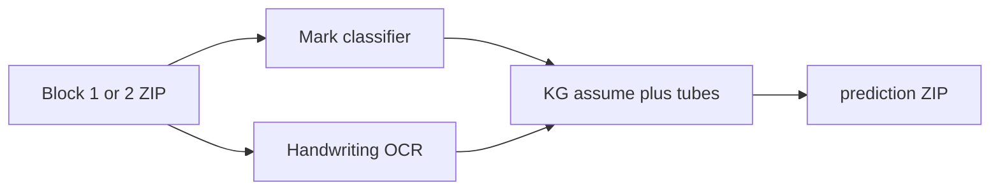
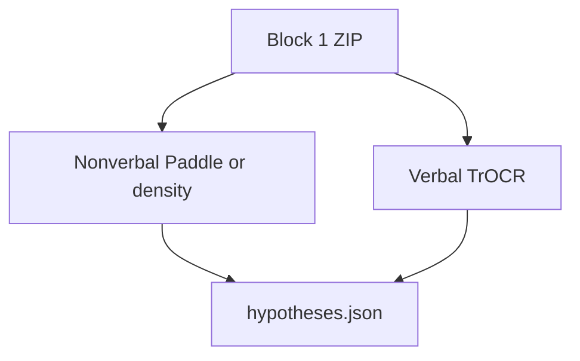
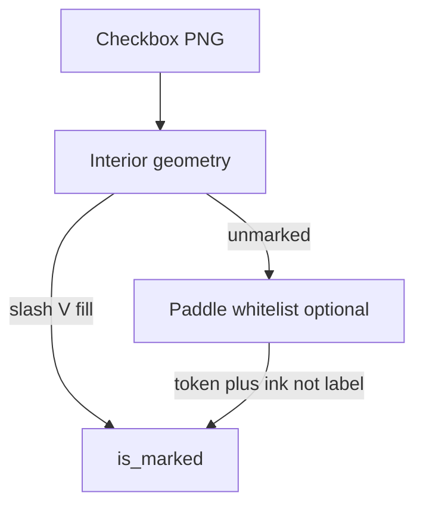
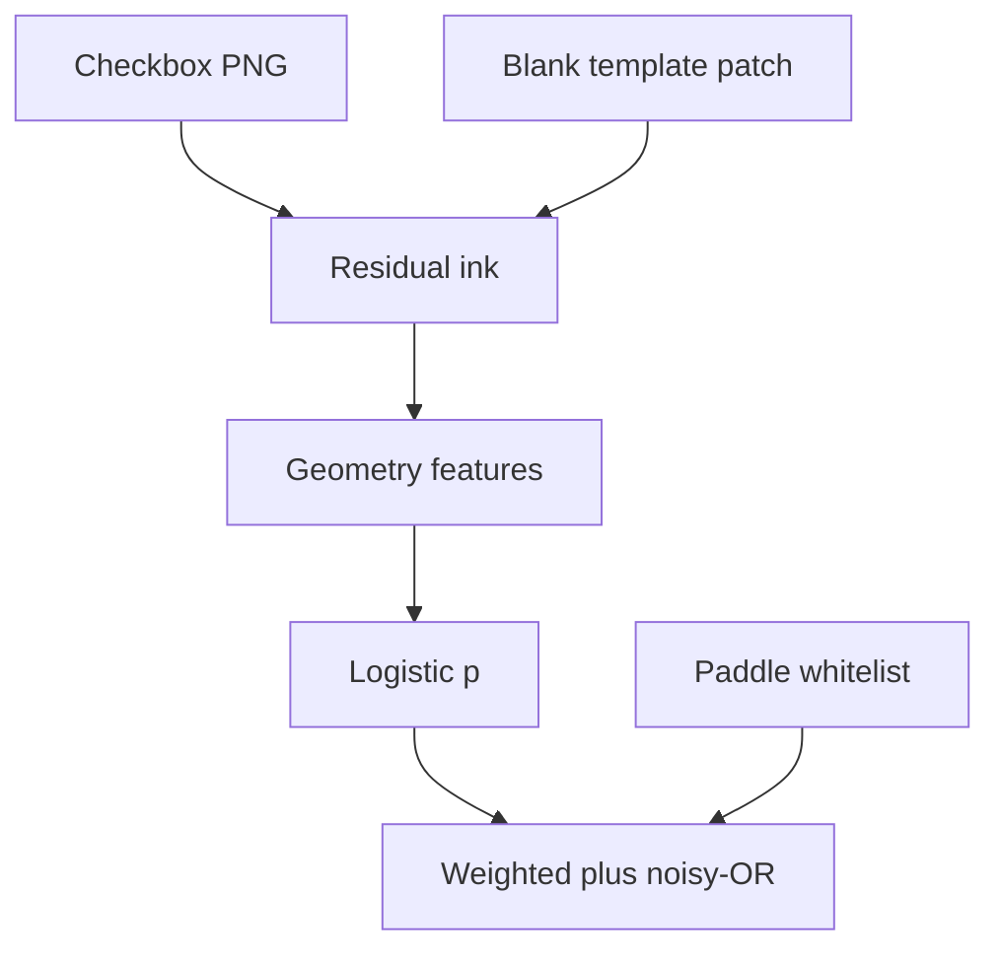

# Block 3 — version history and architecture

**Current generation: B3.6** (template residual + logistic features + Paddle fusion). Ingests a Block 1 ZIP; does not run Block 2 `assume()` or invent tube priors.

Live code: `src/med_doc/htr/` on branch `block1`. Standalone `block3/` Colab tree is **B3.2-era** (Paddle + density fallback, fused ZIP runner remnants).

---

## B3.1 — Fused HTR + prior fusion (2026-08-14)

**Git:** `cec4fda` on `origin/block3`. Fact later superseded: `block3-htr-prior-fusion`.

**Architecture:** One Block 3 runner classified marks, ran handwriting OCR, and fused Block 2 priors (`assume()`, tube `prior_expected` from ticked IDs) into the same ZIP.



**Problem:** False ticks invented tube counts. Priors belong in Block 4.

---

## B3.2 — Verbal / nonverbal split (2026-08-19)

**Git:** `985c807` on `origin/block3`. Facts: `block3-verbal-nonverbal-split`, `block3-ingests-block1-zip-kg-import`, `verbal-drafts-for-block4`.

**Architecture**

- Ingest **Block 1 ZIP only**; import Block 2 as frozen `kg/lab_request_v1_kg.json`.
- **Nonverbal:** PaddleOCR on checkbox crops; density / slash fallback if Paddle missing.
- **Verbal:** TrOCR on handwriting; tubes = digits; `others` stays raw.
- Emit `hypotheses.json`. Qwen out. `process_from_block1(..., mode=nonverbal|verbal|both)`.



Colab together-cell skips Block 1 ZIP upload by default (`648ec74`, `f8d08d6`).

---

## B3.3 — Precision-first interior slash (2026-08-19)

**Fact:** `nonverbal-precision-first`. Session `2026-08-19-112047`.

**Architecture change (same ZIP contract):** A tick must be an **interior** slash or a **filled** box. Printed L-corners and label glyphs unmarked. Verbal `has_ink` area-adaptive. No KG tube fusion in Block 3.

**Data then (clinic 5-sheet, local PHI):** 1 true tick (Culture & ST), 0 false ticks on the other four sheets as scored in that session.

Unit-test crops were 32×32 with a 2 px black frame and a single `/`.

---

## B3.4 — Paddle loophole (diagnosed 2026-08-28)

**Facts:** `demo9-1a1b-paddle-fps`, open thread `demo9-paddle-overcall`.

**Architecture (unchanged files, bad accept rule):**

```text
mark if _looks_like_mark(t) or (t and score >= 0.55)
  and ink_density >= 0.06
```

Any OCR snippet on a slightly dark crop became a tick. Demo9: **7–43 ticks/sheet** with Paddle on vs density-only unmarked. Density path still rejected those as `source=density` (label / mis-crop).

**Data then:** 9 clinic demo photos + digital blank; blank stayed unmarked; `urine_culture` still a density slash on s1.

---

## B3.5 — Interior V/slash + whitelist Paddle (2026-08-31)

**Facts:** `block3-interior-geometry` (supersedes `block3-1ab-synth-recall-zero`). Code: `htr/marks.py`, `htr/nonverbal.py`.

**Architecture**

`classify_mark` uses the **inset interior**, not the PNG edge as the printed frame (1b pads the square):

| Accept | Rule |
|---|---|
| `slash` | One blob, Pearson \|corr\| ≥ 0.70 |
| `v_check` | One or two blobs; V / check / lambda arms |
| `filled` | Interior density ≥ 0.62 |
| empty | Density &lt; 0.06, or leftover ink treated as label |

Reject wide label strips (`looks_like_text_line`). Paddle is a **second vote**: whitelist tokens only (`v`, `/`, `✓`, …). The `score ≥ 0.55` any-text path is **removed**. Geometry must work with Paddle off.

Wrong windows are **Block 1c**, not a Block 3 retry loop.



### Current data (with Block 1 B1.6)

Paddle **unavailable** in the cloud eval. Same 10 gold field IDs as the 0/10 collapse. 124 v0 checkboxes.

| Case | B3.3-style density on 1b (2026-08-31 15:39) | B3.5 + 1c (2026-08-31 16:20) |
|---|---|---|
| Blank digital | 0 FP | **0 FP** |
| 10 ticks digital | **0 TP / 10 FN / 0 FP** | **10 / 0 / 0** |
| Blank photo | 0 FP | **3 FP** (`albumin`, `microalbumin_creatinine`, `shbg`) |
| 10 ticks photo | **0 / 10 / 1** (`ca72_4`) | **4 / 6 / 5** |

Photo TPs: `afp`, `cbc`, `triglycerides`, `uric_acid`. Photo FNs: `cea`, `ca125`, `hba1c`, `profile_lipid`, `profile_liver`, `profile_renal_function`.

Clinic dual-signal dry-run **10 TP / 10 FN / 41 FP** (30% inset, another workspace) is **not** a git tag on this remote and was **not** re-run here (no PHI).

JSON: [data/synthetic-10tick-scorecard.json](./data/synthetic-10tick-scorecard.json).

---

## B3.6 — Template residual + logistic features + Paddle fusion (2026-09-12) — **current**

**After** Block 1 registration, not instead of it.

**Architecture**

1. **Difference image:** register the crop to the matching blank-template patch (`htr/blank.py`); threshold the residual so printed rings/labels subtract to ~0.
2. **Features stay hand-crafted** (density, blob count, correlation, spans, text-line, annulus) but feed a **logistic score** (`train_mark_logreg`) instead of only nested magic cutoffs. Geometry kinds (`slash` / `v_check` / `filled`) still label a mark.
3. **Paddle:** noisy-OR / weighted fusion with geometry when a whitelist token is present; weak OCR cannot override a clearly empty geometry vote.

Isolation eval: distort **crops** (classification) vs shadow on a **page** (registration) in `tests/test_photoreal_marks.py`. Do not treat the N=10 photo scorecard as a significant 4/6/5 vs 0/10/0 comparison.



---

## ZIP outputs (current)

| Path | Contents |
|---|---|
| `docs/{id}/hypotheses.json` | Nonverbal + verbal drafts |
| `docs/{id}/prediction.json` | LIS-shaped prediction (no tube priors from false ticks) |
| `docs/{id}/annotated_canvas.png` | Overlay |
| `manifest.json` | Batch counts |

Block 4 (not shipped): KG `assume()`, tubes, rescoring.
