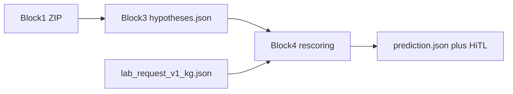

# Block 4 — KG constraint / rescoring (paired with Block 3)

Block 4 consumes Block 3 `hypotheses.json` drafts plus the frozen Block 2 KG. It does **not** re-run OCR and does **not** invent tube counts from false or HiTL ticks.

Live code: `src/med_doc/rescoring/` on branch `block1`. Public API: `process_from_block3()`.

## Architecture

1. **Trusted ticks** — `is_marked` and not `needs_hitl`. Uncertain ticks stay on a HiTL list and never enter `calculate_expected_tubes`.
2. **Write-ins** — each `others` n-best string is passed to `kg.assume`. A canonical id is accepted only on tier-1 + token similarity ≥ 0.72. Otherwise raw text + HiTL. Visual lexicon hits from Block 3 are another hypothesis source, not a KG id.
3. **Tubes** — observed counts come from Block 3 digit drafts only. An empty crop is **missing**, never filled with expected. Mismatch or missing observation → discrepancy + HiTL. `_fuse_tube` no longer has a `prior_expected` fill.
4. **Dates / office_other** — grammar stays in Block 3; Block 4 flags unparsed `received_at` for HiTL. No catalogue match.
5. **`validate_request`** — trusted ticks ∪ accepted write-in ids, plus **observed** tubes (not a copy of expected).
6. **Output** — `docs/<id>/prediction.json`. `hypotheses.json` is copied unchanged.

## What Block 4 does not do

- Does not call `assume()` from live Block 3 `recognize_fields`.
- Does not ingest Block 1 `detected_marks.dark_ratio` as ticks (`src/med_doc/kg/batch.py` still does that on its own path).
- Qwen/LLM rescoring, nurse-count overrides, and clinic PHI eval are out of scope for this pairing.

## Tests

Synthetic draft JSON in `tests/test_block4.py` (no photos): 10 gold ticks vs empty tubes, HiTL false-positive tick excluded from tube priors, `triglyc` + `profile_lipid` → `triglycerides`, tube `"1"` vs expected 1, `"2"` vs 1, empty vs expected 1.
