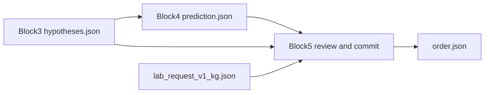

# Block 5 — review, commit, LIS order (paired with Block 4)

Block 5 is the **review-and-commit** layer. It consumes a Block 4 ZIP (`prediction.json` + untouched `hypotheses.json`) and emits a generic lab order. It does **not** re-run OCR and does **not** invent tube counts.

Live code: `src/med_doc/review/` on branch `block1`. Public API: `process_from_block4()`.

## Architecture

1. **HiTL queue** — one item per `hitl_fields` entry (uncertain tick, missing/mismatched tube, weak write-in, unparsed date), with crop path and Block 3 n-best.
2. **Review patches** — `confirm_tick` / `reject_tick` / `set_tube` / `set_text` / `accept_write_in` written to `review.json`. Patches edit **drafts**, then re-enter `rescore_hypotheses`. Original `hypotheses.json` stays auditable.
3. **LLM assist (optional, default off)** — may rank write-in/date n-best only. A suggestion not already in n-best is dropped. Never auto-applied; never emits ticks or tube counts.
4. **LIS commit** — `order.json` from the committed prediction: ordered tests = ticked ∪ implied, tubes = **observed** (null stays null), `needs_review` if HiTL remains.
5. **Registration sanity (independent of CV)** — if ticked ids are ≥45% of `ordered_tests` (and ≥8 ticks), or ≥40 ordered tests, or ticks exist but every tube crop is empty, set `needs_review=True`, `registration_failure_suspected=True`, reason `registration_failure_suspected`. Stops a 19–37 tick dump looking like a committed LIS order.
6. **`overall_confidence`** — from Block 1c retry/HITL rates and empty handwriting-crop rate (plus a tick-flood penalty). Do not triage on the old mean of mark/HTR p-values; those were ~flat for 0-tick vs 37-tick sheets.
7. Clinic PHI eval stays gitignored / out of CI.

## Output

`process_from_block4(..., output_mode=...)` and `run_blocks_1_to_5(..., output_mode=...)`:

- **`user` (pipeline default)** — one file, `order.json`: an `OrderBundle` (`orders: [LabOrder, ...]`). No crops, no per-block ZIPs.
- **`dev`** — Block 1/3/4/5 ZIPs plus the debug tree below.

| Path (dev) | Contents |
|---|---|
| `docs/{id}/hypotheses.json` | Copied Block 3 drafts |
| `docs/{id}/prediction.json` | Copied Block 4 prediction (pre-review) |
| `docs/{id}/review.json` | Queue + patches |
| `docs/{id}/prediction.committed.json` | After patches, Block 4 constraints again |
| `docs/{id}/order.json` | Generic lab-order payload |
| `manifest.json` | Batch counts (`block: block5`) |
| `order.json` | Same `OrderBundle` as user mode |

## Tests

`tests/test_block5.py` (synthetic drafts) and `tests/test_pipeline_blocks.py` (mini Block 1 ZIP and a rendered canonical form through Blocks 1–5).
