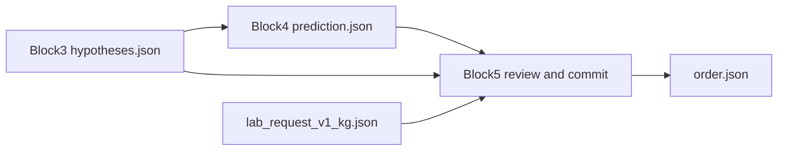

# Block 5 — review, commit, LIS order (paired with Block 4)

Block 5 is the **review-and-commit** layer. It consumes a Block 4 ZIP (`prediction.json` + untouched `hypotheses.json`) and emits a generic lab order. It does **not** re-run OCR and does **not** invent tube counts.

Live code: `src/med_doc/review/` on branch `block1`. Public API: `process_from_block4()`.

## Architecture

1. **HiTL queue** — one item per `hitl_fields` entry (uncertain tick, missing/mismatched tube, weak write-in, unparsed date), with crop path and Block 3 n-best.
2. **Review patches** — `confirm_tick` / `reject_tick` / `set_tube` / `set_text` / `accept_write_in` written to `review.json`. Patches edit **drafts**, then re-enter `rescore_hypotheses`. Original `hypotheses.json` stays auditable.
3. **LLM assist (optional, default off)** — may rank write-in/date n-best only. A suggestion not already in n-best is dropped. Never auto-applied; never emits ticks or tube counts.
4. **LIS commit** — `order.json` from the committed prediction: ordered tests = ticked ∪ implied, tubes = **observed** (null stays null), `needs_review` if HiTL remains.
5. Clinic PHI eval stays gitignored / out of CI.

## Output

| Path | Contents |
|---|---|
| `docs/{id}/hypotheses.json` | Copied Block 3 drafts |
| `docs/{id}/prediction.json` | Copied Block 4 prediction (pre-review) |
| `docs/{id}/review.json` | Queue + patches |
| `docs/{id}/prediction.committed.json` | After patches, Block 4 constraints again |
| `docs/{id}/order.json` | Generic lab-order payload |
| `manifest.json` | Batch counts (`block: block5`) |

## Tests

`tests/test_block5.py` (synthetic drafts) and `tests/test_pipeline_blocks.py` (mini Block 1 ZIP and a rendered canonical form through Blocks 1–5).
