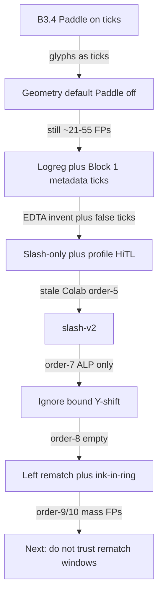

# Clinic eval chain — versions, accuracy, why each failed

**Colab (live `src/med_doc` on branch `block1`):**  
[https://colab.research.google.com/github/RwaRwa599/epq3/blob/block1/Run_in_Colab.ipynb](https://colab.research.google.com/github/RwaRwa599/epq3/blob/block1/Run_in_Colab.ipynb)

**if1 experimental:** [https://colab.research.google.com/github/RwaRwa599/epq3/blob/block1/prototype3.ipynb](https://colab.research.google.com/github/RwaRwa599/epq3/blob/block1/prototype3.ipynb) (`BOOTSTRAP_V8`, default `PIPELINE="if1"`).

Open that notebook, **Runtime → Disconnect and delete runtime**, then **Run all**. The first cell must print **`BOOTSTRAP_V6`** and **`tick_policy: slash-v2`**. It re-downloads `https://codeload.github.com/RwaRwa599/epq3/zip/refs/heads/block1`. If `order.json` has no `tick_policy`, the runtime is stale.

Architecture generations: [block1-versions.md](./block1-versions.md), [block3-versions.md](./block3-versions.md). Machine-readable numbers: [data/clinic-eval-chain.json](./data/clinic-eval-chain.json).

**Accuracy caveat.** Clinic photos are **not** in git (PHI). N is tiny: one labeled sheet for the order-7…9 chain, stubs for two other sheets, plus a 10-tick synthetic v0 scorecard. These are **not** a formal test set. Empty + HiTL is safer to send to LIS than a 20–50 tick dump.

Gold field ids only (`data/labels/examples/`):

| Sheet | Gold ticked ids | N gold |
|---|---|---|
| IMG_7596 (order-2) | `ca125` | 1 |
| IMG_7600 (order-3) | stub `ca125` until relabeled | 1 (stub) |
| IMG_7598 (order-7…9) | `cbc`, `hav_ab_igg`, `hba1c`, `profile_lipid`, `profile_renal`, `profile_thyroid`, `uric_acid` | 7 |

Committed accuracy = field ids on the LIS `ticked` / ordered list vs gold. Uncertain/HiTL ids are **not** counted as TP.

---

## How to read a version

Each row is: **what shipped → measured result → why that was wrong → what the next commit changed**.

---

## Synthetic / non-PHI (committed inputs)

These numbers **are** in git. They are not clinic sheets.

### Block 1 hollow-grid (B1.3, 2026-08-20)

| Setup | Accuracy |
|---|---|
| Synthetic rendered + photographed v0 | **95.2%** hollow/grid (gate did not change it) |
| Clinic 5-sheet mean (local PHI, not in git) | 54.3% → **55.2%** |

Pytest `tests/test_normalization.py` still requires synthetic hollow **≥ 95%**.

### Marks: 10 gold ticks on v0 blank (B1.6 + B3.5, 2026-08-31)

JSON: [data/synthetic-10tick-scorecard.json](./data/synthetic-10tick-scorecard.json). Paddle off. 124 checkboxes.

| Sheet | TP / FN / FP | Precision | Recall |
|---|---|---|---|
| Blank digital | 0 / — / **0** | — | — |
| 10 ticks digital | **10 / 0 / 0** | **1.00** | **1.00** |
| Blank photo (`photograph()` tilt) | 0 / — / **3** | 0 | — |
| 10 ticks photo | **4 / 6 / 5** | **0.44** | **0.40** |

Pre-geometry on the same 10 **digital** ticks: **0 TP / 10 FN / 0 FP** (recall **0**).

Clinic dual-signal dry-run from another workspace: **10 TP / 10 FN / 41 FP**. Not re-run here (no PHI).

### Verbal HTR (B3.7, synthetic putText)

JSON: [data/verbal-accuracy.json](./data/verbal-accuracy.json). Isolated from ticks.

| Task | N | Clean acc. | Photoreal acc. |
|---|---|---|---|
| Tube digits 0–9 | 40 | **1.00** | **1.00** |
| Dates `DD/MM/YYYY` | 6 | **1.00** | **0.50** |
| Others write-ins | 6 | **1.00** | **1.00** |

---

## Clinic / Colab dump chain (PHI photos local only)

### V0 — B3.4 Paddle on checkbox crops (diagnosed 2026-08-28)

**What.** `mark if OCR snippet or score ≥ 0.55` and ink density ≥ 0.06.

**Result.** Demo9: **7–43 predicted ticks per sheet**. Dual-signal note **10 TP / 10 FN / 41 FP**. Digital blank stayed unmarked.

**Why it failed.** Printed glyphs and label letters counted as ticks.

**Next.** Geometry default; Paddle whitelist / opt-in (`mark_backend="geometry"`).

---

### V1 — Interior slash / density (B3.3–B3.5)

**What.** Interior `/`, V, fill. Paddle second vote only.

**Result (clinic 5-sheet, B3.3, local).** 1 true tick (Culture & ST); **0 FP** on the other four as scored then. **B3.5 photo 10-tick:** precision **0.44**, recall **0.40** (table above).

**Why it failed on real clinic crops.** Wrong windows are Block 1c, not a Block 3 retry. Residual + logreg still treated dark label crops as marks once Block 1 metadata was trusted.

**Next.** Residual vs blank + logistic features (B3.6), then stop treating logreg-only / Block 1 `is_marked_candidate` as LIS ticks.

---

### V2 — order-2 / order-3 logreg + metadata ticks (`6878824` era)

**What.** Residual logreg + Block 1 dark-ratio / `is_marked_candidate` could land on the order. Profiles expanded via KG.

**Result.**

| Dump | Sheet | Gold | Committed | TP / FN / FP | Precision | Recall |
|---|---|---|---|---|---|---|
| order-2 | IMG_7596 | 1 (`ca125`) | ~**21** false ticks; **missed CA 125**; invented **EDTA=1** | **0 / 1 / ~21** | **~0** | **0** |
| order-3 | IMG_7600 | stub 1 | ~**55** ticks + profile expansions | **~0 / 1 / ~55** | **~0** | **0** |

**Why it failed.** Metadata and logistic p-values on label/mis-crop windows are not ticks. False ticks invented tube counts (Block 3/4 fusion leak).

**Next.** Do not commit logreg-only or Block 1 metadata ticks; do not invent EDTA from empty crops (`6878824`).

---

### V3 — Slash-only + `profile_*` always HiTL (`d8c1a68`, `a67ef8c`)

**What.** Commit only `/` (or dense fill). Sparse V = HiTL. Profiles do not auto-expand onto the order.

**Result.** User still pasted **order-5** with profiles + `implied_tests` = **stale Colab**, not this code. Accuracy of the dump is **not** V3.

**Why it failed.** Colab caches `/content/epq3`. Opening a notebook from GitHub does **not** fetch `src/`.

**Next.** Stamp `tick_policy` on `OrderBundle`; **BOOTSTRAP_V6** always zipball-refreshes and prints `tick_policy: slash-v2`.

---

### V4 — slash-v2 (`9af79a9`) — **tick_policy on order.json**

**What.** Stricter slash on clinic rings; V not auto-commit; named `profile_*` HiTL in that commit; tube OCR count **>4 dropped**.

**Result (order-7, IMG_7598).**

| | |
|---|---|
| Gold | 7 ids |
| Committed | **`alp` only** (letters `ck` in the crop) |
| Uncertain (examples) | plan_1, chol, uric_acid, t4, tgab |
| **TP / FN / FP** | **0 / 7 / 1** |
| **Precision / recall** | **0 / 0** |

**Why it failed.** Chemistry/immunology **column Y-shift hit the search bound** (±24 px = one label row). ALP crop was printed letters, not a tick. True ticks were one row off.

**Next.** Ignore `column_y_shifts` at the search bound (`80233a4`). Treat label glyphs ≠ ticks; allow named `profile_*` auto-commit when the crop is a real box; plans stay HiTL.

---

### V5 — Bound-lag column shift (`80233a4`)

**What.** Drop Y-shifts that saturate the search bound. Clipped-check detect. Profiles may auto-commit.

**Result.**

| Dump | Committed ticked | TP / FN / FP | Precision | Recall |
|---|---|---|---|---|
| Local re-run after `80233a4` | **empty** | **0 / 7 / 0** | n/a (no positives) | **0** |
| **order-8** (same sheet in Colab) | **`ticked=[]`** | **0 / 7 / 0** | n/a | **0** |

order-8 warnings mixed **true `hba1c`** with FPs (amylase, HSV, UA, …). Classifier can see a clipped check; `crop_needs_hitl` blocked auto-commit.

**Why it failed.** 1b landed on **names / blank paper**. 1c did **not** search ink-in-ring from a blank 1b window. Empty order is **worse for the user** than ALP-only: every gold tick is FN and nothing is reviewable as a committed id.

**Next.** 1c: search left on label strips; always ink-in-ring; piecewise match radius 64, min 6 inliers (`786156f`).

---

### V6 — Left rematch + ink-in-ring (`786156f`) — **current code**

**What.** If 1b is a label strip, snap to the same-row box on the left. Search includes ink-in-ring so a ticked box is not skipped because 1b was blank.

**Result (order-9, IMG_7598, N gold = 7).**

| | |
|---|---|
| Committed | **10** ids |
| **TP** | **2** (`hba1c`, `cbc`) |
| **FP** | **8** |
| **FN** | **5** |
| **Precision** | **2/10 = 0.20** |
| **Recall** | **2/7 ≈ 0.29** |

**order-10** (9 docs `batchsample1–9`, unlabeled): ~**19–37 ticked ids/sheet** except sample3 empty. Profile expansion inflates to **40–50+ ordered** tests. Garbage `others_raw`; dates `00/00/0000`, `01/08/2088`; junk tubes (e.g. pap=92, EDTA=14). **Do not send to LIS.**

**Why it failed.** Rematch **trusted wrong windows**. HiTL-all → empty (V5). Trust rematch → mass FPs (V6). Tube OCR is still unconstrained except count >4 dropped.

**Next (not shipped).** Do not auto-commit from rematch unless the crop is a hollow ring **and** a slash/check; keep empty+HiTL safer than order-10; constrain tube/date decoders; fine-tune TrOCR **after** ticks stabilize.

---

## Precision vs recall lever (current)

| Policy | Typical clinic outcome | Use |
|---|---|---|
| HiTL when `crop_needs_hitl` | order-8: **0 committed**, recall **0** | Safer for LIS |
| Auto-commit rematched ink | order-9: P **0.20**, R **0.29**; order-10: **19–37 ticks/sheet** | Not safe for LIS |

Default Colab: `output_mode="user"` (one `order.json`), `patch_missing_edta=False`, `tick_policy=slash-v2`.

---

## Block 4 / 5 (no separate clinic accuracy yet)

Block 4 rescoring is scored in `tests/test_block4.py` (synthetic drafts). It does not invent tubes from HiTL ticks. Clinic dumps above already include KG profile expansion when ticks were trusted — that is why 10 FPs become 40–50 ordered tests.

---

## Reproduction

1. Colab link at the top of this file (branch `block1`).
2. Gold: `data/labels/examples/IMG_7598.json` (and 7596 / 7600 stubs).
3. Never git-add clinic JPEGs.
