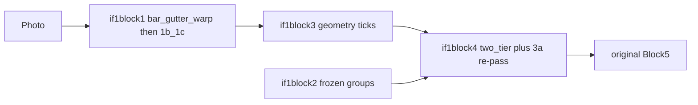

# if1 — experimental parallel pipeline

Sibling to live Blocks 1–5. **Does not replace** `normalize_document()` / `run_blocks_1_to_5`. Package: `med_doc.if1`. Mix-and-match: if1block1 ZIP is a Block 1 crop tree; original `process_from_block1` can ingest it. Original Block 4 can ingest if1block3 hypotheses (`ticked_test_ids` aliases the 3a snapshot).



| ID | Role |
|---|---|
| if1block1 | CHECK-UP + section bars + gutters → RANSAC affine (fallback: `warp_to_canonical`), then existing 1b/1c |
| if1block2 | Frozen named groups (`kg/if1_groups_v0.json`) + coverage scorer |
| if1block3 | Geometry ticks; `initial_ticked_test_ids` is immutable 3a snapshot |
| if1block4 | Same scorer for missing/extra **and** `ordered_tests_high` / `ordered_tests_low`; 3a re-pass on flags |
| Block 5 | Unchanged. `run_if1` maps **high only** into `ticked_test_ids` / LIS `ordered_tests`; low-conf ids are warnings |

OCR/VLM do **not** propose tickbox crops. Diagnosis strings on groups are review labels, not LIS test ids.

## Coverage scorer (placeholder math)

For frozen group \(g\) with member weights \(w_{t,g}\) and prior \(\pi_g\) (seeded as 1.0):

\[
s_g=\text{coverage},\quad a_g=\pi_g s_g
\]
\[
m(u)=a_g w_{u,g}(1-x_u),\quad e(u)=x_u(1-s_g w_{u,g})
\]

Ticking the group id (printed profile box) sets \(s_g=1\). Thresholds \(\tau_{\mathrm{miss}}=0.35\), \(\tau_{\mathrm{odd}}=0.50\) split high vs low. **The same \(m,e\)** feed flags and the two lists.

- high: still ticked after 3a re-pass and \(e < \tau_{\mathrm{odd}}\)
- low: missing (\(m \ge \tau_{\mathrm{miss}}\), even if 3a empty) ∪ extras (\(e \ge \tau_{\mathrm{odd}}\), even if 3a confirmed a slash)
- `initial_ticked_test_ids` is never edited by the scorer or LLM

`e` uses coverage \(s_g\) (not \(\pi_g\)) so a placeholder prior does not demote in-group ticks.

## Research placeholder

**Not implemented:** generating \(w_{t,g},\pi_g\) from data (Dirichlet/Beta shrinkage, causal discovery, LLM-proposed edges). `estimate_groups_from_counts()` raises `NotImplementedError`. Local clinic tweaks: `kg/if1_local_overrides.json` (`prior_multipliers`, `disabled_groups`); `load_groups(apply_local=True)` to apply.

## Public API

```python
from med_doc.if1 import run_if1, normalize_document, process_from_if1block1, process_from_if1block3
```
